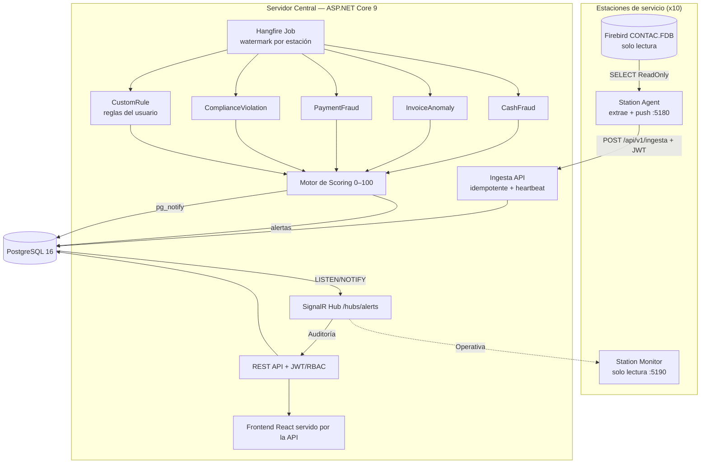

# PetrolRíos — Sistema de Detección de Anomalías Transaccionales

> Proyecto de tesis de Ingeniería de Software — Universidad de Las Américas (UDLA)

Sistema web que detecta **anomalías transaccionales** (fraude y errores operativos) en
~13.000–15.000 transacciones diarias provenientes de 10 estaciones de servicio de PetrolRíos S.A.,
cada una con su base **Firebird (Contaplus) en solo lectura**. Un motor de **5 detectores** corre
cada pocos minutos, clasifica cada hallazgo con un **score de riesgo 0–100** y notifica las alertas
**en tiempo real**, separándolas en dos carriles: **Auditoría** (fraude) y **Operativa** (errores de
estación).

> ℹ️ El **código es la fuente de verdad** del proyecto y va por delante del documento de tesis
> (`docs/tesis.md`), que es una versión preliminar. Este README refleja el estado real del sistema.

## Las tres aplicaciones

| Aplicación | Qué es | Dónde corre | Puerto (dev) |
|---|---|---|---|
| **Central** | API ASP.NET Core 9 + frontend React. Recibe la ingesta, corre los detectores (Hangfire), guarda las alertas y sirve la aplicación web. La API **sirve también el frontend compilado** (un solo ejecutable/contenedor en producción). | Un servidor (cualquier SO). | API `5170`, web `5173` (en producción todo por `8080`) |
| **Station Agent** | Worker que lee el Firebird local **en solo lectura**, extrae por marca de agua y **empuja** los datos al central (modelo push, store-and-forward). Tiene panel local de configuración y diagnóstico. | En cada estación (la PC con `CONTAC.FDB`). | `5180` |
| **Station Monitor** | Visor local de **solo lectura** que muestra al personal de la estación únicamente **sus** problemas operativos. No toca Firebird ni envía nada. | En cada estación. | `5190` |

## Arquitectura (modelo push — Alternativa B de la tesis)



**Push con store-and-forward:** cada estación extrae sus transacciones y las envía al central por
REST. Si el central no responde, el agente guarda los lotes en disco y los reintenta. La ingesta es
**idempotente** (huella SHA-256 por contenido + índice único), así que un reenvío no duplica datos
ni alertas.

**Tiempo real entre instancias sin Redis:** cuando el job genera una alerta, publica un
`pg_notify` en PostgreSQL; **cada instancia** del central escucha ese canal (`LISTEN/NOTIFY`) y la
reenvía por SignalR a sus propios clientes. Así, con varias instancias del central conectadas a la
**misma** base, todos los usuarios ven las alertas al instante **sin recargar la página**.

## Dos carriles de alerta

Cada regla declara su **ámbito** (`AmbitoAlerta`, editable por regla):

- **Auditoría** — fraude. Va a la bandeja de Alertas del central (auditores/supervisores).
- **Operativa** — error honesto de la estación (turno sin cerrar, despacho no facturado, campos
  faltantes…). **No** ensucia la bandeja de auditoría: aparece en "Problemas de estación" del
  central y en el **Monitor** local, y se avisa por correo al contacto de la estación.

## Stack tecnológico

| Capa | Tecnología |
|---|---|
| Backend | ASP.NET Core 9.0, C# 13, EF Core 9 (Code-First + migraciones), Dapper |
| Jobs batch | Hangfire (almacenamiento en PostgreSQL) |
| Tiempo real | SignalR (WebSockets) + PostgreSQL `LISTEN/NOTIFY` (fan-out multi-instancia) |
| Seguridad | JWT + refresh tokens, RBAC, 2FA (TOTP/QR), verificación de correo, BCrypt |
| Reportes | QuestPDF (PDF) + ClosedXML (Excel) |
| Frontend | React 18, TypeScript 5 (strict), Vite, TailwindCSS, shadcn/ui |
| Datos (frontend) | TanStack Query, Axios, Zod, `@microsoft/signalr`, Recharts |
| BD central | PostgreSQL 16 (local en dev; AWS RDS u otra en producción) |
| Fuentes | 10 × Firebird (Contaplus `CONTAC.FDB`), **solo lectura** vía `FirebirdSql.Data.FirebirdClient` |
| Pruebas | xUnit, FluentAssertions, Moq, Testcontainers (PostgreSQL real en integración) |
| Despliegue | Docker (multi-stage), ejecutables self-contained, Inno Setup |

## Detectores y motor de reglas

5 detectores con **Strategy Pattern**. Tras refactorizar, **cada regla es su propia clase**
(`IDetectionRule`) y se **auto-registra por reflexión**: agregar una regla = agregar un archivo, sin
tocar el detector ni la DI. Hay **25 reglas** sembradas (editables desde la interfaz: umbral inline,
activar/desactivar, y carril Operativa/Auditoría por regla).

| Detector | Ejemplos de reglas |
|---|---|
| **CashFraudDetector** | Faltante de efectivo > umbral por turno; patrón gineteo (≥3 faltantes/30 días); proporción atípica de efectivo corporativo; turno sin cerrar (operativa). |
| **InvoiceAnomalyDetector** | Tasa de anulaciones atípica; descuento fuera de política; total inconsistente; campos obligatorios vacíos (operativa); fecha fuera de rango/backdating; despacho no facturado (operativa); anulaciones recurrentes (kiting). |
| **PaymentFraudDetector** | Reversión de tarjeta tardía; crédito sin autorización/garante; transacciones duplicadas; despachos rápidos sucesivos. |
| **ComplianceViolationDetector** | Placa genérica `ZZZ999949` con galones > máximo (ARCERNNR); mismo vehículo con diésel y extra el mismo día; venta sin placa en monto mayor; operación fuera de horario (opt-in, apagada por operar 24/7). |
| **CustomRuleDetector** | **Reglas que crea el propio usuario** sin tocar código. |

**Motor de reglas personalizadas (sin redepliegue):** el Supervisor/Admin crea reglas desde la UI
sobre cualquier fuente (incluidas tablas Firebird registradas dinámicamente), en **modo básico**
(condiciones combinadas con **Y/O** + agregaciones Conteo/Suma/Promedio) o **modo avanzado** (un
mini-lenguaje de expresiones seguro, sin `eval`, con funciones matemáticas y de texto). Incluye
**vista previa / backtest** contra datos reales antes de guardar y una galería de plantillas. Todo
se valida contra un catálogo (lista blanca anti-inyección).

**Scoring:** `Score = Riesgo_Base × Multiplicadores`, normalizado a 0–100 → **Bajo** 0–25, **Medio**
26–50, **Alto** 51–75, **Crítico** 76–100.

**Ciclo de detección:** Hangfire corre el job **cada minuto** en desarrollo (configurable; 5–10 min
en producción). Recorre estación por estación usando una **marca de agua** (watermark) por estación
y por fuente, con tolerancia a fallos: si una estación falla, las demás continúan.

## Seguridad

JWT con refresh tokens y **RBAC** de 3 roles (Auditor, Supervisor, Administrador) más **cuentas de
estación** aisladas (un claim firmado `estacion_id` limita al Monitor/Agente a su propia estación).
Doble factor por **TOTP/QR**, verificación de correo configurable, **autodesbloqueo** de cuenta y
bloqueo anti fuerza bruta, hashing BCrypt y **logs de auditoría** (quién, qué e IP) en todas las
escrituras. Los secretos (SMTP, JWT, conexión) **nunca** se suben al repositorio.

## Conexión a la base de datos: flexible y editable (sin tocar código)

La cadena de conexión se resuelve por prioridad: **variables de entorno**
(`ConnectionStrings__PostgreSQL` o `PETROLRIOS_DB`) › **`config/connection.json`** (guardado desde la
app, git-ignorado) › `appsettings`. El Administrador la edita y **prueba** desde
**Ajustes → Conexión a la base**, y en el **primer arranque** sin base alcanzable aparece un
**asistente de configuración inicial** en el navegador. La base vive en **un solo lugar**; todas las
instancias del central se conectan a la misma.

## Inicio rápido (desarrollo)

**Lo más fácil (Windows):** doble clic en `ejecutables/1-INICIAR-Y-DETENER/iniciar-todo-el-sistema.bat` — arranca Docker,
PostgreSQL, Firebird, la API, el frontend, el agente y el monitor, y abre el navegador.
Ver `ejecutables/LEEME.md` para el detalle de cada script.

**Manual:**

```bash
# 1) PostgreSQL
docker compose up -d

# 2) Backend (API en http://localhost:5170 — Swagger en /swagger, Hangfire en /hangfire)
dotnet restore && dotnet build
dotnet run --project src/PetrolRios.Api

# 3) Frontend (http://localhost:5173)
cd frontend && npm install && npm run dev

# 4) Station Agent (panel en http://localhost:5180) — opcional
dotnet run --project src/PetrolRios.StationAgent

# 5) Station Monitor (http://localhost:5190) — opcional
dotnet run --project src/PetrolRios.StationMonitor
```

Al primer arranque se ejecutan las migraciones y el seed idempotente:

- Administrador: **admin@petrolrios.com** / **Admin123!** (obliga a cambiarla)
- Auditor demo: `auditor@petrolrios.com` / `Auditor123!` · Supervisor demo: `supervisor@petrolrios.com` / `Supervisor123!`
- Cuentas de estación: `agent-est-001@petrolrios.com` … `agent-est-010@petrolrios.com`
- 25 reglas de detección con umbrales por defecto

**Prerrequisitos:** [.NET 9 SDK](https://dotnet.microsoft.com/download/dotnet/9.0),
[Node.js 20+](https://nodejs.org/), [Docker](https://www.docker.com/) y Git.

## Producción y despliegue

Todo (central, agente, monitor y la base) corre en **Windows, Linux y macOS**. La guía paso a paso,
a prueba de errores, está en **`INSTALACION/GUIA.md`**, con instaladores para los 3 sistemas:

- **Central:** `docker compose -f docker-compose.prod.yml up -d --build` (todo en uno), o
  `docker-compose.db.yml` (solo la base) + `docker-compose.central.yml` (central apuntando a una base
  externa). La API sirve la SPA; un solo contenedor entrega toda la aplicación.
- **Estaciones (sin VPN):** el agente y el monitor **llaman hacia afuera** a la URL pública del
  central (túnel/cloud/port-forward); la base **nunca** se expone. Se instalan como servicio (Windows
  `sc`, Linux `systemd`, macOS `launchd`) para arrancar solos tras un corte de luz.
- **Actualización remota:** el central se actualiza desde tu PC con
  `INSTALACION/actualizar-central.ps1` (o `.sh`) — sube a GitHub y por SSH hace `git pull` + rebuild.
  Los agentes y monitores se **auto-actualizan** desde un manifiesto (versión + URL + SHA-256).

## Estructura del proyecto

```
PetrolRios.sln
├── src/
│   ├── PetrolRios.Domain/          Entidades, enums, interfaces de dominio (sin dependencias)
│   ├── PetrolRios.Application/      Casos de uso, DTOs, interfaces, RealTime (IAlertaBroadcaster)
│   ├── PetrolRios.Infrastructure/   EF Core, repositorios, Dapper, Firebird, Hangfire,
│   │                                SignalR, LISTEN/NOTIFY, ConexionStore
│   ├── PetrolRios.Detectors/        5 detectores + Rules/<Detector>/ (25 reglas) + scoring
│   │                                + motor de reglas personalizadas (expresiones, backtest)
│   ├── PetrolRios.Api/              Controllers, JWT, middlewares, ingesta, Setup (wizard), Program.cs
│   ├── PetrolRios.StationAgent/     Worker + panel local (lee Firebird, push al central)
│   └── PetrolRios.StationMonitor/   Visor local de solo lectura por estación
├── tests/
│   ├── PetrolRios.Domain.Tests/
│   ├── PetrolRios.Detectors.Tests/  CRÍTICO: cobertura > 80% (OE5)
│   ├── PetrolRios.Api.Tests/        Integración/E2E con PostgreSQL real (Testcontainers)
│   └── PetrolRios.StationMonitor.Tests/
├── frontend/                        React 18 + TS + Vite + Tailwind (components, pages, hooks,
│                                    services [API + SignalR], types, lib)
├── ejecutables/                     Scripts operativos (1-INICIO, 2-DEMO, 3-DIAGNOSTICO,
│                                    4-PUBLICACION, 5-DESARROLLO) — ver ejecutables/LEEME.md
├── INSTALACION/                     Instaladores Win/Linux/macOS + GUIA.md + deploy remoto
├── _arranque/                       Solo recursos de la BD Firebird de demo (ver _arranque/LEEME.md)
├── docs/                            tesis.md, contac-schema.sql, ARQUITECTURA.md, OPERACION.md,
│                                    DESPLIEGUE.md, ANALISIS-SEGURIDAD.md, investigación
├── scripts/                         verificar-todo-gate-oficial.bat, coverage.ps1/.sh
├── docker-compose*.yml              dev / prod / db / central
├── CLAUDE.md · CAMBIOS.md · README.md
```

## Pruebas y cobertura

```bash
dotnet test                       # todas las pruebas
.\scripts\coverage.ps1            # cobertura (Windows) → coverage-report/
ejecutables\5-DESARROLLO\verificar_build_y_tests.bat   # gate completo antes de commitear
```

Estado: **más de 200 pruebas en verde** (Domain, Detectors, API con PostgreSQL real, Monitor). La
**cobertura de `PetrolRios.Detectors` es 96,3 % en líneas** (84,9 % en ramas) — **supera con holgura
el umbral del 80 % exigido por el OE5**. Reproducible con `scripts/coverage.ps1`.

```bash
cd frontend
npm run build    # verificación de tipos + build de producción
npm run lint     # ESLint
```

## API (endpoints principales)

| Método | Ruta | Rol mínimo | Descripción |
|---|---|---|---|
| POST | `/api/v1/auth/login` · `/login-totp` · `/refresh` · `/olvide-password` · `/desbloquear-cuenta` | Público | Sesión, 2FA, recuperación y desbloqueo |
| POST | `/api/v1/ingesta` · `/ingesta/heartbeat` | Estación | Recibir lote (idempotente) y señal de vida |
| GET | `/api/v1/dashboard/*` | Autenticado | KPIs, tendencia, por tipo/estación, top empleados |
| GET / PATCH | `/api/v1/alertas` · `/{id}` · `/{id}/estado` | Autenticado | Listar/filtrar, detalle, cambiar estado |
| GET / POST | `/api/v1/alertas/{id}/comentarios` · `/{id}/asignar` | Auditor / Supervisor | Comentarios de auditoría y asignación |
| GET | `/api/v1/alertas/problemas-estacion` | Autenticado | Carril Operativa agrupado por estación |
| GET / PUT | `/api/v1/reglas` · `/reglas-personalizadas` (+ `/catalogo`, `/backtest`) | Supervisor+ | Motor de detección configurable |
| GET | `/api/v1/monitoreo/conexiones` · `/sistema` | Autenticado | Estado de estaciones, BD, SignalR, motor |
| GET/POST/PUT/DELETE | `/api/v1/usuarios` · `/estaciones` | Admin / Supervisor | Gestión de usuarios y estaciones |
| GET | `/api/v1/conexion-base` · POST `/probar` · `/guardar` | Admin | Conexión a la base, editable y verificable |
| GET | `/api/v1/reportes/*` · `/logs` | Supervisor / Admin | Reportes PDF/Excel y auditoría |

## Roles

| Rol | Permisos |
|---|---|
| **Auditor** | Dashboard, listar/filtrar alertas, cambiar estado, comentar, notificaciones en vivo |
| **Supervisor** | + asignar alertas, configurar reglas/umbrales, generar reportes, métricas |
| **Administrador** | + gestionar usuarios y estaciones, conexión a la base, logs de auditoría |
| **Cuenta de estación** | Solo su estación: el Agente ingesta y el Monitor ve sus problemas operativos |

## Documentación adicional

- `ejecutables/LEEME.md` — qué hace cada script operativo.
- `INSTALACION/GUIA.md` — instalación en producción paso a paso (Windows/Linux/macOS).
- `docs/OPERACION.md` · `docs/DESPLIEGUE.md` — operación y despliegue.
- `docs/ANALISIS-SEGURIDAD.md` — análisis de seguridad.
- `CAMBIOS.md` — bitácora detallada de todo lo construido.

## Licencia

Proyecto académico — Universidad de Las Américas (UDLA), 2026.
