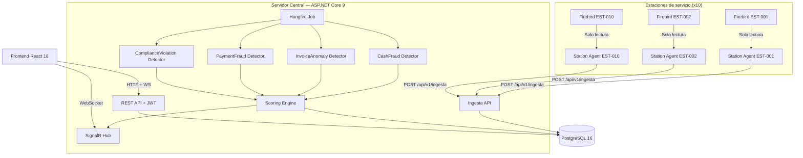

# PetrolRios — Sistema de Deteccion de Anomalias Transaccionales

> Proyecto de tesis de Ingenieria de Software — Universidad de Las Americas (UDLA)

Sistema web que detecta anomalias transaccionales en ~13,000-15,000 transacciones diarias
provenientes de 10 estaciones de servicio de PetrolRios S.A. Ejecuta 4 detectores especializados
cada 5 minutos y notifica alertas en tiempo real.

## Arquitectura (modelo push — Alternativa B de tesis)



> **Modelo push con store-and-forward:** Cada estacion tiene un `.NET Worker Service` (Station Agent)
> que extrae transacciones de su Firebird local y las envia al servidor central via REST. Si el
> servidor no esta disponible, el agente almacena los lotes como JSON local y los reintenta en el
> siguiente ciclo.

## Stack tecnologico

| Capa | Tecnologia |
|------|-----------|
| Backend | ASP.NET Core 9.0, C# 13, EF Core 9, Dapper |
| Jobs | Hangfire con PostgreSQL storage |
| Tiempo real | SignalR (WebSockets) |
| Autenticacion | JWT + Refresh Tokens, RBAC (3 roles) |
| Frontend | React 18, TypeScript 5, Vite, TailwindCSS |
| Data fetching | TanStack Query, Axios, Zod |
| Graficos | Recharts |
| BD central | PostgreSQL 16 |
| Agentes | PetrolRios.StationAgent (.NET Worker Service, 1 por estacion) |
| Fuentes | 10 x Firebird (solo lectura, accedidas por agentes locales) |
| Testing | xUnit, FluentAssertions, Moq, Testcontainers |

## Prerrequisitos

- [.NET 9 SDK](https://dotnet.microsoft.com/download/dotnet/9.0)
- [Node.js 20+](https://nodejs.org/) (LTS recomendado)
- [Docker](https://www.docker.com/) y Docker Compose
- Git

## Inicio rapido

### 1. Clonar el repositorio

```bash
git clone <url-del-repo>
cd petrolrios-anomaly-detection
```

### 2. Levantar PostgreSQL

```bash
docker compose up -d
```

Esto inicia PostgreSQL 16 en el puerto 5432 con las credenciales configuradas en `docker-compose.yml`.

### 3. Backend

```bash
dotnet restore
dotnet build
cd src/PetrolRios.Api
dotnet run
```

El API arranca en `http://localhost:5000`.
- Swagger UI: `http://localhost:5000/swagger`
- Hangfire Dashboard: `http://localhost:5000/hangfire`

Al iniciar por primera vez, se ejecutan las migraciones y se insertan datos semilla:
- Usuario admin: `admin@petrolrios.com` / `Admin123!`
- 10 usuarios agente: `agent-est-001@petrolrios.com` ... `agent-est-010@petrolrios.com` / `Agent123!`
- 10 estaciones de servicio
- 12 reglas de deteccion con umbrales por defecto

### 4. Frontend

```bash
cd frontend
npm install
npm run dev
```

Accede a `http://localhost:5173`. Inicia sesion con las credenciales del admin.

### 5. Station Agent (por estacion)

Cada estacion ejecuta un Worker Service que envia transacciones al servidor central.

```bash
cd src/PetrolRios.StationAgent
dotnet run
```

Configurar en `appsettings.json` del agente:

| Parametro | Descripcion | Ejemplo |
|-----------|------------|---------|
| `Agent:CodigoEstacion` | Codigo de la estacion | `EST-001` |
| `Agent:ServerUrl` | URL del servidor central | `http://localhost:5000` |
| `Agent:IntervaloSegundos` | Frecuencia de extraccion | `300` |
| `Agent:FirebirdConnectionString` | Conexion a Firebird local (solo lectura) | `User=SYSDBA;Password=masterkey;...` |
| `Agent:Email` | Credencial JWT del agente | `agent-est-001@petrolrios.com` |
| `Agent:Password` | Password del agente | `Agent123!` |

El agente implementa **store-and-forward**: si el servidor no responde, los lotes se guardan como JSON
en `Agent:LocalStorePath` y se reintentan en el siguiente ciclo.

## Variables de entorno

La configuracion de desarrollo esta en `src/PetrolRios.Api/appsettings.Development.json`.
Para produccion, usa variables de entorno o `appsettings.Production.json` (no comiteado).

| Variable | Descripcion | Ejemplo |
|----------|------------|---------|
| `ConnectionStrings__PostgreSQL` | Connection string PostgreSQL | `Host=localhost;Database=petrolrios;...` |
| `Jwt__SecretKey` | Clave secreta JWT (min. 32 caracteres) | `MiClaveSecretaSuperSegura32Chars!` |
| `Jwt__Issuer` | Emisor del token JWT | `PetrolRios.Api` |
| `Jwt__Audience` | Audiencia del token JWT | `PetrolRios.Frontend` |
| `Cors__FrontendUrl` | URL del frontend | `http://localhost:5173` |
| `Hangfire__CronExpression` | Frecuencia del job de deteccion | `*/5 * * * *` |

## Estructura del proyecto

```
PetrolRios.sln
├── src/
│   ├── PetrolRios.Domain/            Entidades, enums, interfaces de dominio
│   ├── PetrolRios.Application/       Casos de uso, DTOs, interfaces de repositorios
│   ├── PetrolRios.Infrastructure/    EF Core, repositorios, Firebird, Hangfire, SignalR
│   ├── PetrolRios.Api/               Controllers, JWT, middlewares, ingesta, Program.cs
│   ├── PetrolRios.Detectors/         4 detectores + motor de scoring
│   └── PetrolRios.StationAgent/      Worker Service para estaciones (push model)
├── tests/
│   ├── PetrolRios.Domain.Tests/      Tests de entidades de dominio
│   ├── PetrolRios.Detectors.Tests/   Tests unitarios de detectores (>80% cobertura)
│   └── PetrolRios.Api.Tests/         Tests de integracion y E2E
├── frontend/                          React 18 + TypeScript + Vite + Tailwind
│   ├── src/
│   │   ├── components/               Componentes reutilizables (UI, layout, auth)
│   │   ├── pages/                    Paginas (Login, Dashboard, Alertas, etc.)
│   │   ├── services/                 Clientes API + SignalR
│   │   ├── contexts/                 AuthContext con gestion de JWT
│   │   ├── hooks/                    Hooks personalizados
│   │   ├── types/                    Tipos TypeScript
│   │   └── lib/                      Utilidades (cn)
│   └── ...
├── docs/
│   ├── tesis.md                       Documento de tesis completo
│   ├── PROMPT.md                      Especificacion de bloques
│   ├── ARQUITECTURA.md                Diagramas C4 (Mermaid)
│   └── contac-schema.sql             Schema Firebird (Contaplus)
├── scripts/
│   ├── coverage.sh                    Script de cobertura (Linux/macOS)
│   └── coverage.ps1                   Script de cobertura (Windows)
├── docker-compose.yml
├── CLAUDE.md                          Instrucciones del proyecto
└── README.md                          Este archivo
```

## Detectores de anomalias

El sistema implementa 4 detectores mediante **Strategy Pattern**, cada uno configurable via reglas en base de datos:

| Detector | Tipo | Reglas |
|----------|------|--------|
| **CashFraudDetector** | Fraude de efectivo | Diferencia efectivo vs sistema > $50/turno; Patron gineteo (>3 faltantes en 30 dias) |
| **InvoiceAnomalyDetector** | Anomalia de factura | Anulaciones > 5% diario; Precio fuera de lista; Campos obligatorios vacios |
| **PaymentFraudDetector** | Fraude de pago | Reversion tarjeta > 30 min; Credito sin autorizacion; Transacciones duplicadas |
| **ComplianceViolationDetector** | Violacion normativa | Placa ZZZ999949 > 5 galones; Multiples combustibles/dia; Fuera de horario |

**Scoring:** `Score = RiesgoBase x Multiplicadores` (0-100)
- Bajo: 0-25 | Medio: 26-50 | Alto: 51-75 | Critico: 76-100

## Pruebas

### Ejecutar todas las pruebas

```bash
dotnet test
```

### Ejecutar con cobertura

**Linux/macOS:**
```bash
chmod +x scripts/coverage.sh
./scripts/coverage.sh
```

**Windows (PowerShell):**
```powershell
.\scripts\coverage.ps1
```

Los reportes de cobertura se generan en `coverage-report/`.

### Tipos de pruebas

| Proyecto | Tipo | Cantidad | Descripcion |
|----------|------|----------|-------------|
| `PetrolRios.Domain.Tests` | Unitarias | 4 | Entidades y enums del dominio |
| `PetrolRios.Detectors.Tests` | Unitarias | 46+ | 4 detectores + scoring (>80% cobertura) |
| `PetrolRios.Api.Tests` | Integracion | 13+ | Auth, Dashboard, Alertas con PostgreSQL real |
| `PetrolRios.Api.Tests` | E2E | 6+ | Ciclo completo ETL->deteccion->persistencia->SignalR |

### Frontend

```bash
cd frontend
npm run build    # Verificacion de tipos TypeScript
npm run lint     # ESLint
```

## API Endpoints

| Metodo | Ruta | Rol minimo | Descripcion |
|--------|------|-----------|-------------|
| POST | `/api/v1/auth/login` | Publico | Iniciar sesion |
| POST | `/api/v1/auth/refresh` | Publico | Renovar JWT |
| POST | `/api/v1/auth/logout` | Autenticado | Cerrar sesion |
| POST | `/api/v1/ingesta` | Autenticado | Recibir lote de transacciones (Station Agent) |
| GET | `/api/v1/dashboard/kpis` | Autenticado | KPIs del sistema |
| GET | `/api/v1/dashboard/alertas-por-tipo` | Autenticado | Alertas por tipo detector |
| GET | `/api/v1/dashboard/alertas-por-estacion` | Autenticado | Alertas por estacion |
| GET | `/api/v1/alertas` | Autenticado | Listar alertas (con filtros y paginacion) |
| GET | `/api/v1/alertas/{id}` | Autenticado | Detalle de alerta |
| PATCH | `/api/v1/alertas/{id}/estado` | Autenticado | Cambiar estado de alerta |
| POST | `/api/v1/alertas/{id}/asignar` | Supervisor+ | Asignar alerta a auditor |
| GET/POST/PUT/DELETE | `/api/v1/reglas` | Supervisor+ | Gestionar reglas de deteccion |
| GET/POST/PUT/DELETE | `/api/v1/usuarios` | Admin | Gestionar usuarios |
| GET | `/api/v1/logs` | Admin | Consultar logs de auditoria |

## Roles y permisos

| Rol | Permisos |
|-----|---------|
| **Auditor** | Ver dashboard, listar/filtrar alertas, cambiar estado, recibir notificaciones |
| **Supervisor** | Todo lo del Auditor + asignar alertas, configurar reglas, generar reportes |
| **Administrador** | Todo lo del Supervisor + gestionar usuarios, consultar logs |

## Licencia

Proyecto academico — Universidad de Las Americas (UDLA), 2026.
