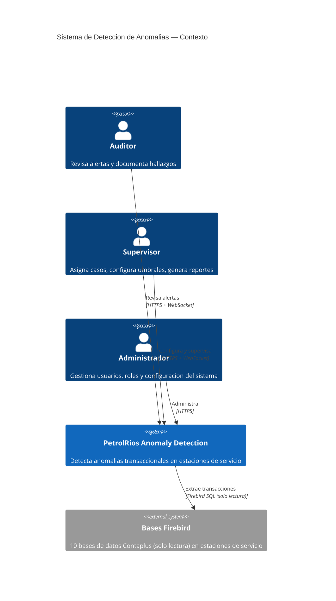
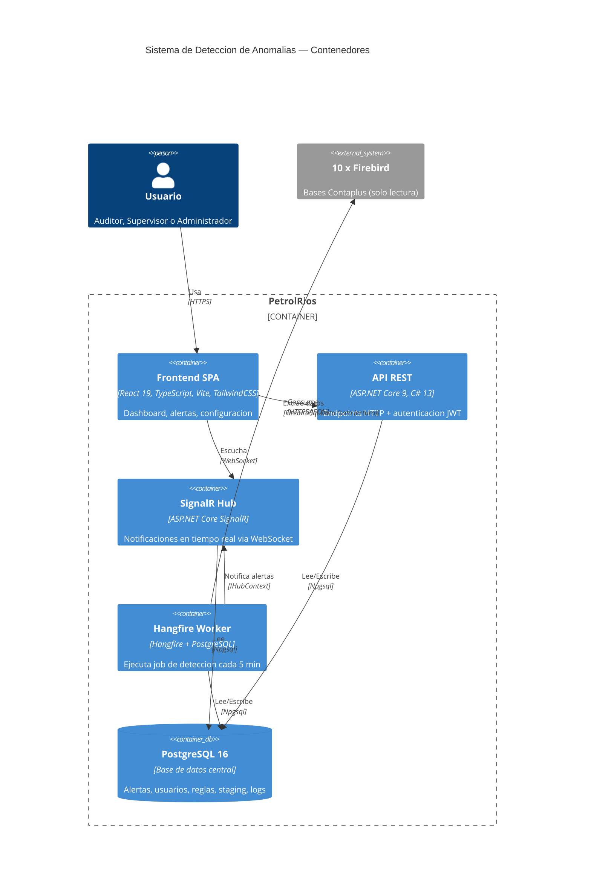
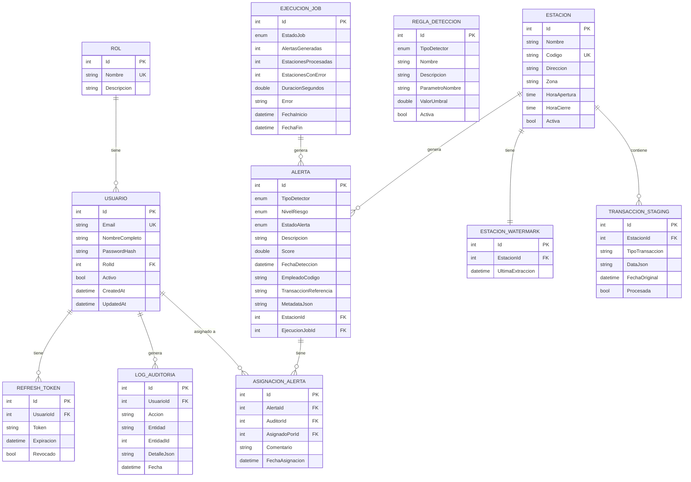
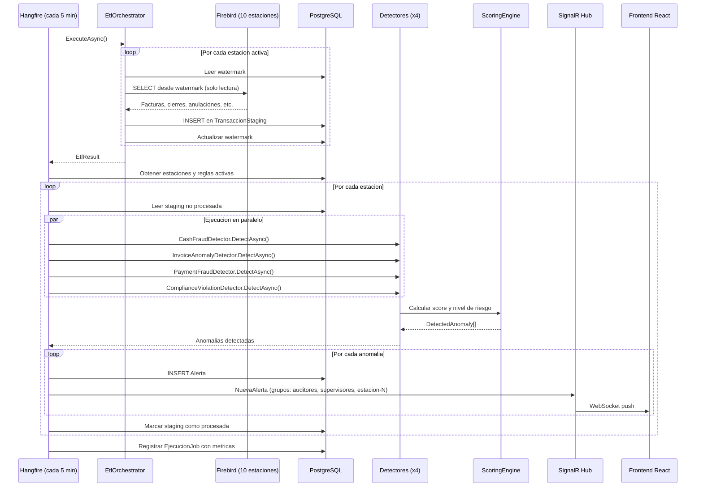
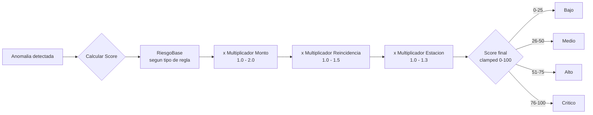

# Arquitectura del Sistema — PetrolRios

Diagramas C4 en formato Mermaid que describen la arquitectura del sistema de deteccion de
anomalias transaccionales.

## Nivel 1 — Diagrama de Contexto

## Nivel 2 — Diagrama de Contenedores

## Nivel 3 — Diagrama de Componentes (Backend)

```mermaid
C4Component
    title Backend — Componentes internos

    Container_Boundary(api_layer, "PetrolRios.Api") {
        Component(auth_ctrl, "AuthController", "Controller", "Login, refresh, logout")
        Component(alertas_ctrl, "AlertasController", "Controller", "CRUD de alertas")
        Component(dashboard_ctrl, "DashboardController", "Controller", "KPIs y metricas")
        Component(reglas_ctrl, "ReglasController", "Controller", "Configuracion de reglas")
        Component(usuarios_ctrl, "UsuariosController", "Controller", "Gestion de usuarios")
        Component(logs_ctrl, "LogsController", "Controller", "Logs de auditoria")
        Component(jwt_middleware, "JWT Middleware", "Middleware", "Autenticacion Bearer")
        Component(exception_middleware, "ExceptionHandling", "Middleware", "Manejo global de errores")
    }

    Container_Boundary(app_layer, "PetrolRios.Application") {
        Component(auth_svc, "IAuthService", "Servicio", "Autenticacion y tokens")
        Component(alerta_svc, "IAlertaService", "Servicio", "Logica de alertas")
        Component(dashboard_svc, "IDashboardService", "Servicio", "Calculo de KPIs")
        Component(regla_svc, "IReglaService", "Servicio", "Gestion de reglas")
        Component(usuario_svc, "IUsuarioService", "Servicio", "Gestion de usuarios")
    }

    Container_Boundary(detectors_layer, "PetrolRios.Detectors") {
        Component(cash_det, "CashFraudDetector", "Strategy", "Fraude de efectivo")
        Component(invoice_det, "InvoiceAnomalyDetector", "Strategy", "Anomalias de factura")
        Component(payment_det, "PaymentFraudDetector", "Strategy", "Fraude de pago")
        Component(compliance_det, "ComplianceViolationDetector", "Strategy", "Violaciones normativas")
        Component(scoring, "RiskScoringEngine", "Singleton", "Calculo de score 0-100")
    }

    Container_Boundary(infra_layer, "PetrolRios.Infrastructure") {
        Component(dbcontext, "PetrolRiosDbContext", "EF Core", "Acceso a PostgreSQL")
        Component(repos, "Repositories", "Repository Pattern", "IAlertaRepository, IEstacionRepository, etc.")
        Component(uow, "UnitOfWork", "UoW Pattern", "Transaccionalidad")
        Component(etl, "EtlOrchestrator", "Servicio", "Extraccion incremental de Firebird")
        Component(firebird_client, "FirebirdSourceClient", "Dapper", "Queries SQL solo lectura")
        Component(job, "AnomalyDetectionJob", "Hangfire Job", "Ciclo ETL -> Deteccion -> Notificacion")
        Component(hub, "AlertsHub", "SignalR Hub", "Notificaciones en tiempo real")
        Component(jwt_svc, "JwtService", "Servicio", "Generacion y validacion de tokens")
    }

    Rel(auth_ctrl, auth_svc, "Delega")
    Rel(alertas_ctrl, alerta_svc, "Delega")
    Rel(dashboard_ctrl, dashboard_svc, "Delega")
    Rel(auth_svc, jwt_svc, "Genera tokens")
    Rel(auth_svc, repos, "Consulta usuarios")
    Rel(alerta_svc, repos, "CRUD alertas")
    Rel(job, etl, "Paso 1: Extrae datos")
    Rel(job, cash_det, "Paso 2: Detecta")
    Rel(job, invoice_det, "Paso 2: Detecta")
    Rel(job, payment_det, "Paso 2: Detecta")
    Rel(job, compliance_det, "Paso 2: Detecta")
    Rel(cash_det, scoring, "Calcula score")
    Rel(job, hub, "Paso 3: Notifica")
    Rel(etl, firebird_client, "Extrae de Firebird")
    Rel(repos, dbcontext, "Accede a datos")
```

## Nivel 4 — Diagrama ER (Entidades principales)

## Flujo de deteccion de anomalias

## Modelo de scoring

